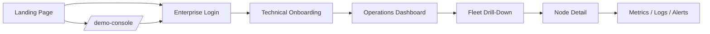
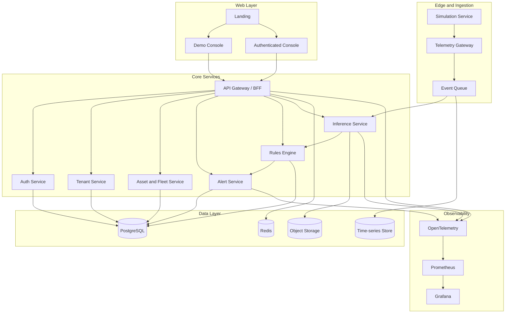
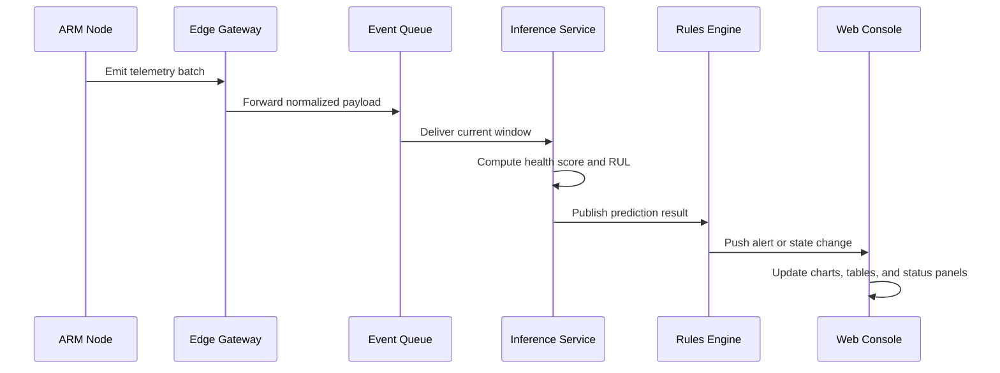
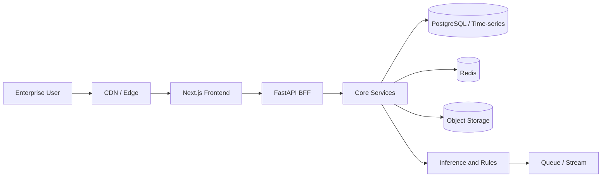

# ARM Health SaaS Architecture

## 1. Product Definition

ARM Health is an infrastructure monitoring and predictive maintenance SaaS for enterprise ARM-based device fleets. The platform is designed for operational teams that need telemetry, diagnostics, alerting, and optimization rather than consumer-facing workflows.

The product is intentionally closer to Alibaba Cloud, Huawei Cloud, Datadog, and Grafana than to a traditional marketing-led SaaS website. The UI must prioritize density, speed, and direct control.

## 2. Core Product Principles

- High information density with multiple metrics visible at once.
- Minimal decorative treatment and no emotional onboarding patterns.
- Operational language, not consumer language.
- Drill-down first: fleet -> region -> node -> device -> metric -> event.
- Demo before login: visitors should be able to inspect a realistic sandbox immediately.

## 3. Recommended Stack

### Frontend

- Next.js 15 with React 19.
- TypeScript.
- Tailwind CSS for layout speed and consistent density.
- shadcn/ui for composable primitives.
- Recharts or ECharts for compact dashboards.
- Three.js or react-three-fiber for the digital twin and node visualization.
- TanStack Query for server state and real-time refetch orchestration.
- Zustand for local UI state.

### Backend

- FastAPI for the API layer.
- Python for telemetry processing, model inference, and business rules.
- WebSocket or Server-Sent Events for live console updates.
- Celery or a lightweight task queue for alert jobs and background processing.

### Data Layer

- PostgreSQL for tenants, users, assets, alerts, and audit logs.
- TimescaleDB extension or a dedicated time-series model for telemetry.
- Redis for cache, sessions, and transient state.
- Object storage for raw telemetry batches, model artifacts, and export bundles.

### AI and Simulation

- Python ML services for RUL prediction and anomaly scoring.
- Synthetic telemetry generator for the demo console.
- Rule engine for thresholds, health state transitions, and alert escalation.

### Infrastructure

- Docker for local and CI execution.
- Kubernetes for production workloads.
- Nginx or a managed ingress layer for routing and TLS termination.
- OpenTelemetry for tracing and metrics across services.
- Prometheus and Grafana for internal observability of the platform itself.

## 4. Web Architecture

The web app should be organized around three entry paths:

1. Public landing page for technical credibility.
2. Demo console for instant product exploration without login.
3. Authenticated operations console for enterprise users.

After login, the application should move quickly into fleet visibility and operational drill-down, not into soft onboarding screens.

## 5. Frontend Route Map

The route structure should remain simple and explicit.

- `/` - Landing page.
- `/demo-console` - Public sandbox with fake but credible ARM fleet data.
- `/auth/login` - Email/password plus SSO entry.
- `/onboarding` - Technical intake form for infrastructure setup.
- `/app` - Main authenticated console.
- `/app/fleet` - Fleet overview.
- `/app/nodes/[id]` - Node detail page.
- `/app/metrics` - Metrics and health history.
- `/app/logs` - Event and log exploration.
- `/app/alerts` - Active and historical alerts.

## 6. Experience Flow

### 6.1 Landing to Demo

The landing page should establish trust through concrete product evidence: architecture diagrams, live system stats, supported environments, and example alerts. The primary call to action should be the demo console, not login.

### 6.2 Demo Console

The demo console should simulate:

- Active ARM nodes across one or more regions.
- CPU, memory, temperature, power, and thermal throttling indicators.
- Health scores and predicted degradation trends.
- Alert stream entries and maintenance recommendations.
- Drill-down from fleet view to node view to metric panels.

### 6.3 Login

Login should support:

- Email and password.
- Enterprise SSO.
- Persistent sessions.
- Optional MFA in a later phase.

### 6.4 Onboarding

The onboarding flow should ask for only technical inputs:

- Infrastructure type.
- Node count.
- Region.
- Workload type such as AI, compute, or edge.

No marketing-style onboarding, animations, or social content should appear here.

## 7. System Architecture

## 8. Real-Time Data Flow

Telemetry should move through the system in a controlled pipeline so the UI can stay responsive even when event rates increase.

## 9. Console Layout Strategy

The authenticated console should follow a split-density layout:

- Left rail for fleet and navigation.
- Top bar for tenant, region, environment, and user controls.
- Main grid for charts, maps, status cards, and logs.
- Right-side detail panel for the selected node or alert.

The default dashboard should include:

- Fleet health summary.
- Node status table.
- Time-series telemetry charts.
- Active alerts feed.
- Degradation and RUL trend panel.
- Recent logs and anomaly events.

## 10. Deployment Model

Recommended deployment path:

- Frontend on a managed web platform or containerized ingress.
- API and worker services on Kubernetes.
- Managed database with backups and read replicas.
- Dedicated observability stack from day one.

## 11. Key Product Decisions

- Use a BFF layer so the frontend gets dashboard-ready payloads instead of raw service responses.
- Keep demo data isolated from tenant data.
- Design every major screen for side-by-side comparison, not single-card storytelling.
- Treat logs, metrics, and alerts as first-class citizens in the UI.
- Prefer deterministic operational flows over animated or marketing-heavy interactions.

## 12. Phase 1 Build Order

1. Define the route structure and information architecture.
2. Build the landing page and demo console shell.
3. Implement auth and technical onboarding.
4. Add fleet overview, node detail, metrics, and logs.
5. Connect live telemetry, alerting, and the digital twin.
6. Harden the deployment, observability, and tenant separation.

## 13. Open Questions

- Which cloud provider should host the first production environment?
- Should the demo console share the same codebase as the authenticated app, or be isolated as a public experience?
- Do we want the first release to support multi-tenant billing, or only tenant provisioning?
- Which telemetry granularity is the minimum viable default for ARM nodes?
