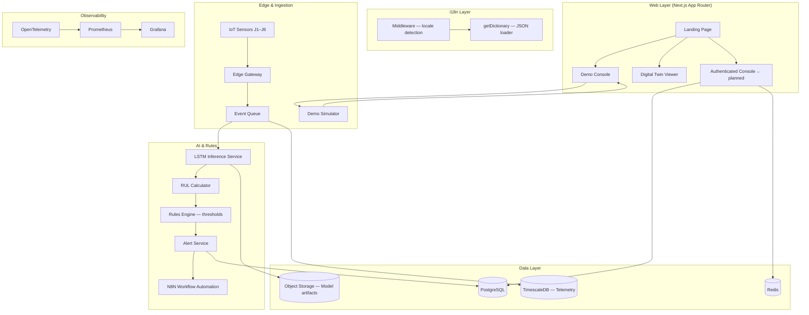
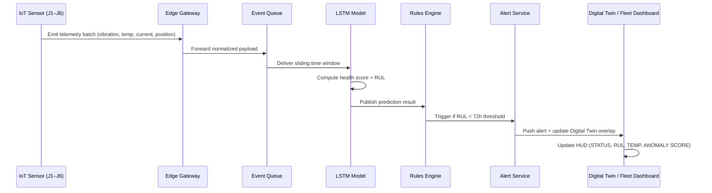

# Arm Health AI — System Architecture

> **Last updated:** April 2026 · Aligned with current implementation

## 1. Product Definition

**Arm Health AI** is a SaaS predictive maintenance platform for industrial robotic arms (6-axis). It provides real-time AI-powered Digital Twins, joint telemetry monitoring, Remaining Useful Life (RUL) prediction, anomaly detection, and automated maintenance alerting.

The platform targets operational teams in automotive, semiconductor, aerospace, and healthcare manufacturing — environments where robotic arm downtime costs $22,000+ per minute.

The product occupies the intersection of Industrial IoT and AI-driven predictive maintenance. The interface is optimized for technical credibility and conversion, with information density suited to the Chinese B2B market.

---

## 2. Core Product Principles

- **Predict, don't react.** Every screen should reinforce the shift from scheduled maintenance to AI-driven prediction.
- **Demo before login.** Visitors can explore a realistic sandboxed fleet immediately — no registration required.
- **Data density over whitespace.** Dashboard-first UX designed for operational teams and B2B buyers.
- **Drill-down hierarchy:** Fleet → Node → Joint → Metric → Alert → Work Order.
- **Bilingual from day one.** Full `en-US` and `zh-Hans` support across all routes (BCP-47 standard).

---

## 3. Production Stack

### Frontend (Implemented)

| Layer | Technology |
|---|---|
| Framework | Next.js 15 (App Router) + React 19 + TypeScript |
| Styling | Vanilla CSS with custom design system (no Tailwind) |
| 3D Visualization | Three.js, React Three Fiber (`@react-three/fiber`) |
| 3D Helpers | `@react-three/drei` (OrbitControls, SpotLight, Grid, AccumulativeShadows…) |
| Post-processing | `@react-three/postprocessing` (Bloom, Vignette, ACES Filmic tone mapping) |
| Internationalization | BCP-47 dynamic locale routing (`[locale]` segment) + custom `getDictionary()` |
| Robot Model | SIASUN SR12A — GLB format at `public/models/siasunsr12a.glb` |

### Backend (Target Architecture)

| Layer | Technology |
|---|---|
| API Layer | FastAPI (Python) |
| AI / Inference | Python · LSTM model (TensorFlow / Keras) |
| IoT Ingestion | Edge Gateway simulation · Python preprocessing scripts |
| Telemetry Pipeline | Event queue → AI inference → Rules Engine → Alert |
| Alert Automation | N8N workflow orchestration |
| Realtime | WebSocket / Server-Sent Events for live console updates |

### Data Layer

| Store | Purpose |
|---|---|
| PostgreSQL | Tenants, users, assets, alerts, audit logs |
| TimescaleDB | Joint telemetry time-series (J1–J6: vibration, temperature, current, position) |
| Redis | Cache, sessions, transient state |
| Object Storage | Model artifacts, raw telemetry batches, export bundles |

### Infrastructure

- Docker for local development and CI
- Kubernetes for production workloads
- Nginx / managed ingress for routing and TLS
- OpenTelemetry + Prometheus + Grafana for observability

---

## 4. Route Architecture (Current)

All public routes live under the `[locale]` dynamic segment for i18n:

```
/en-US/                     ← Landing page (Hero + ProcessSection + FeatureSplit + ContactCta)
/en-US/platform             ← Platform overview + feature pipeline
/en-US/digital-twin         ← 3D Digital Twin page (SIASUN SR12A interactive viewer)
/en-US/ai-engine            ← LSTM model explainer + RUL chart
/en-US/fleet                ← Fleet monitoring dashboard
/en-US/use-cases            ← Industry use cases
/en-US/demo-console         ← Public sandbox (simulated fleet + alert stream)
/en-US/pricing              ← Pricing tiers

/zh-Hans/*                  ← Full Simplified Chinese versions of all above routes

/(onboarding)/*             ← Technical onboarding flow (planned)
/(app)/*                    ← Authenticated operations console (planned)
```

The middleware (`src/middleware.ts`) intercepts bare routes (`/`) and redirects to the default locale (`/en-US`).

```mermaid
flowchart LR
    Root[/] -->|middleware redirect| EN[/en-US/]
    EN --> Demo[/en-US/demo-console]
    EN --> Twin[/en-US/digital-twin]
    EN --> Login[/auth/login ← planned]
    Demo --> Login
    Login --> Onboard[/(onboarding) ← planned]
    Onboard --> App[/(app) ← planned]
    App --> Fleet[/app/fleet]
    App --> Node[/app/nodes/:id]
    App --> Alerts[/app/alerts]
```

---

## 5. Full System Architecture



---

## 6. AI Pipeline — RUL Prediction



**Target performance:** >95% prediction accuracy · 72+ hours failure lead time · <100ms telemetry latency

---

## 7. Internationalization Architecture

The i18n system uses Next.js App Router's dynamic `[locale]` segment with BCP-47 locale identifiers.

```
src/
├── middleware.ts                  ← Intercepts bare routes, redirects to /en-US
├── app/[locale]/
│   ├── layout.tsx                 ← Async root layout: awaits params.locale, sets <html lang>
│   └── (public)/
│       ├── layout.tsx             ← Loads getDictionary(locale), injects into PublicShell
│       └── */page.tsx             ← Each page calls getDictionary and uses common.[section]
├── locales/
│   ├── en-US/common.json          ← English strings (home, nav, platform, fleet, demo…)
│   └── zh-Hans/common.json        ← Simplified Chinese strings
└── lib/
    └── i18n.ts                    ← getDictionary() — server-only loader
```

**Supported locales:** `en-US` (default), `zh-Hans`  
**Planned:** `zh-Hant` (Traditional Chinese)

Dictionary namespace structure:

```json
{
  "home":       { "title", "subtitle", "ctaStart", "ctaDemo", "trustStat1…4" },
  "nav":        { "product", "platform", "fleet", "pricing", "resources"… },
  "platform":   { "title", "subtitle", "feat1Title"… },
  "digitalTwin":{ "title", "demoTitle", "feat1Title"… },
  "aiEngine":   { "title", "lstmTitle", "valTitle"… },
  "fleet":      { "title", "nodes", "healthy", "warning", "critical"… },
  "useCases":   { "title", "tag1", "desc1"… },
  "demo":       { "title", "fleetNodes", "colNode", "colRul", "alerts"… },
  "cta":        { "title", "demo", "talk", "healthTitle"… }
}
```

---

## 8. 3D Digital Twin Architecture

The robot viewer uses a layered R3F scene:

```
RobotViewerClient  [use client — next/dynamic ssr:false wrapper]
  └─ RobotViewer  [Canvas owner]
       ├─ SceneSetup         → Background color (#07091a), FogExp2, shadow maps
       ├─ SceneLights        → useDepthBuffer + 3 SpotLights (indigo key, amber fill, deep-blue rim)
       ├─ Suspense
       │    ├─ RobotModel    → useGLTF + useAnimations + Box3 auto-fit + rotation animation
       │    ├─ BaseGlow      → Ring geometry with indigo emission (#4F46E5)
       │    ├─ AccumulativeShadows + BakeShadows
       │    └─ Grid          → Infinite floor grid (indigo palette)
       ├─ EffectComposer     → Bloom (ACES filmic) + Vignette
       └─ OrbitControls      → Drag/zoom; pan disabled
```

**GLB model:** `public/models/siasunsr12a.glb`  
⚠️ **Known limitation:** The current GLB is a CAD export without a kinematic armature. All joint segments are siblings under the root node — not a parent-child chain. Full joint articulation requires rigging in Blender with a 6-bone armature (J1–J6) before re-export.  
**Workaround:** Smooth Y-axis rotation + micro pitch/roll oscillations simulate activity at rest.

---

## 9. Business Model

| Tier | Price | Features |
|---|---|---|
| **Basic** | Per robot/month | Real-time health monitoring + manual alerts |
| **Standard** | Per robot/month | + RUL prediction + anomaly detection |
| **Premium** | Per robot/month | + Automated work orders + optimization + dedicated support |
| **HaaS** | Hardware bundle | Proprietary sensor kit bundled with subscription |
| **Consulting** | One-time fee | MES/CMMS system integration |

---

## 10. Phase 1 Build Order (Completed → In Progress)

| # | Task | Status |
|---|---|---|
| 1 | Route structure + i18n architecture | ✅ Done |
| 2 | Landing page + public marketing pages | ✅ Done |
| 3 | Demo console (simulated fleet + alerts) | ✅ Done |
| 4 | Interactive 3D Digital Twin viewer | ✅ Done |
| 5 | Full `en-US` + `zh-Hans` dictionary coverage | ✅ Done |
| 6 | Auth + technical onboarding | 🔲 Planned |
| 7 | Fleet overview, node detail, metrics, logs, alerts | 🔲 Planned |
| 8 | Live telemetry WebSocket + AI inference integration | 🔲 Planned |
| 9 | GLB rigging (Blender) for joint articulation | 🔲 Planned |
| 10 | Deployment hardening + observability + tenant isolation | 🔲 Planned |

---

## 11. Open Questions

- Which cloud provider hosts the first production environment? (AWS, Ali Cloud, or Tencent Cloud for CN market)
- Should the demo console share the same component library as the authenticated app, or be isolated?
- First release: multi-tenant billing or only tenant provisioning?
- Minimum telemetry granularity per joint for the free tier?
- Traditional Chinese (`zh-Hant`) — priority for next locale iteration?
