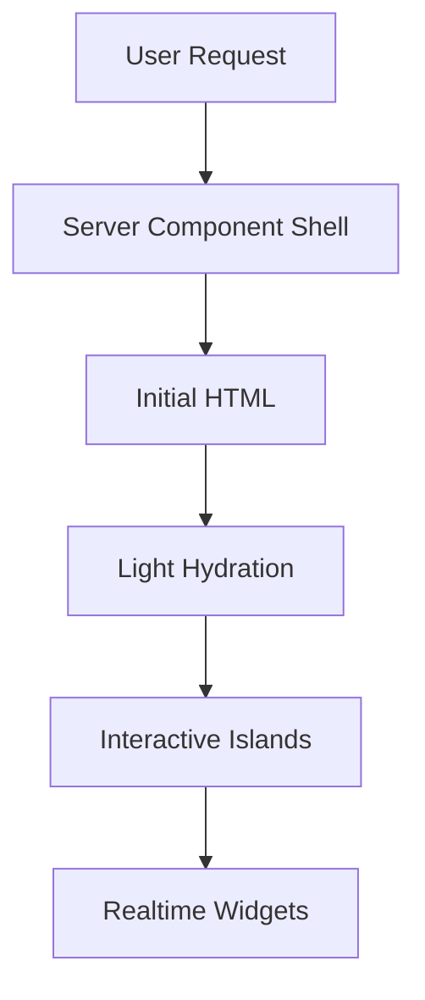
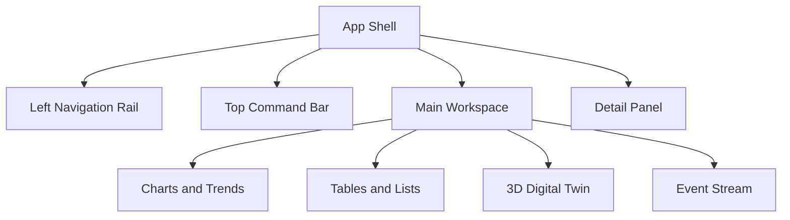
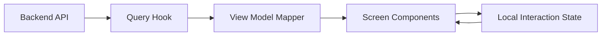
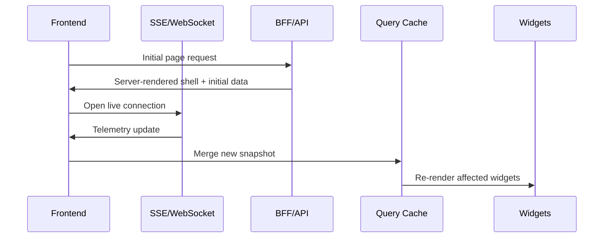
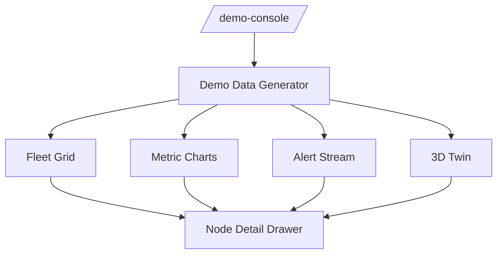
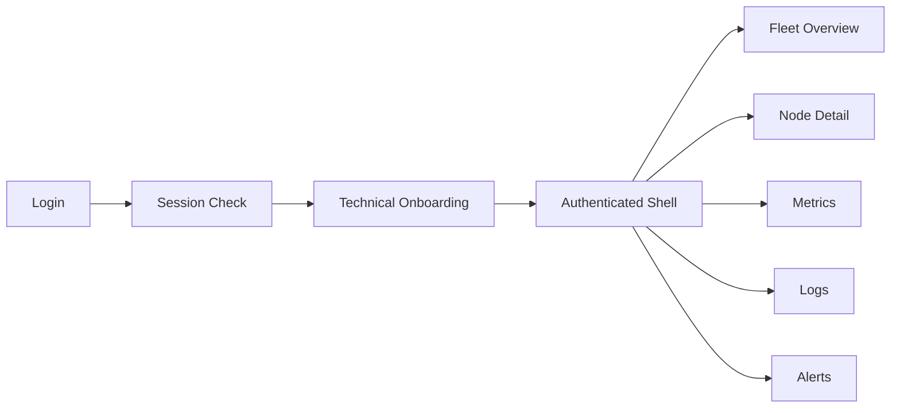
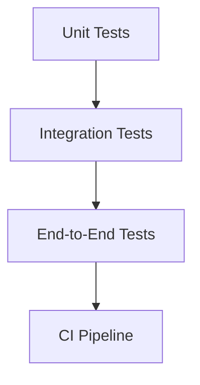

# ARM Health Frontend Architecture

## 1. Purpose

This document defines the frontend architecture for ARM Health, with a strong focus on performance, operational clarity, and enterprise-grade density. The interface must feel like a control plane for critical infrastructure, not a marketing website.

The frontend should support three primary experiences:

1. Public credibility through a technical landing page.
2. A no-login demo console with realistic ARM fleet telemetry.
3. A highly efficient authenticated operations console.

## 2. Frontend Design Principles

- Optimize for information density, not whitespace.
- Keep critical metrics visible without navigation friction.
- Prefer server-rendered shells and streamed data over heavy client-only rendering.
- Use client-side state only where interaction demands it.
- Make every high-value screen usable on the first load.
- Separate public demo data from tenant data at the route and API layers.

## 3. Recommended Frontend Stack

### Core Framework

- Next.js 15 with App Router.
- React 19.
- TypeScript.
- Tailwind CSS.

### UI System

- shadcn/ui for composable primitives.
- Radix UI under the hood for accessibility and behavior.
- Custom design tokens for spacing, color, status, and typography.
- Lucide icons for concise operational iconography.

### Data and State

- TanStack Query for server state, caching, refetching, and request deduplication.
- Zustand for lightweight client state.
- React Hook Form and Zod for form handling and validation.
- TanStack Table for dense, virtualized operational tables.

### Visualization

- ECharts or Recharts for compact telemetry charts.
- Three.js or react-three-fiber for the digital twin and 3D asset views.
- React virtual or row virtualization for large fleets and logs.

### Realtime and Transport

- Server-Sent Events for one-way live status streams where appropriate.
- WebSockets for interactive control surfaces and live demo feeds.
- Fetch-based route handlers for simple request/response interactions.

### Quality and Tooling

- ESLint and Prettier.
- Vitest for unit tests.
- Playwright for end-to-end tests.
- Storybook for isolated component review if the team wants a stronger design system workflow.

## 4. Architecture Goals for Performance

The frontend should be optimized around the following constraints:

- Minimal client hydration on the landing page.
- Server components by default.
- Small interactive islands instead of large client bundles.
- Streaming and incremental rendering for live dashboard views.
- Memoization only where it solves a measured problem.
- Virtualization for tables, logs, and any list that can exceed a few dozen rows.

## 5. Route and Screen Architecture

The route structure should map directly to product intent.

- `/` - Technical landing page.
- `/demo-console` - Public sandbox with simulated fleet data.
- `/auth/login` - Email/password and SSO.
- `/onboarding` - Technical onboarding questionnaire.
- `/app` - Authenticated shell.
- `/app/fleet` - Fleet overview.
- `/app/nodes/[id]` - Node detail.
- `/app/metrics` - Time-series telemetry and health trends.
- `/app/logs` - Event and log explorer.
- `/app/alerts` - Alert queue and alert history.
- `/app/settings` - Tenant and user settings.

```mermaid
flowchart LR
    Landing[Landing /] --> Demo[/demo-console]
    Landing --> Login[/auth/login]
    Demo --> Login
    Login --> Onboarding[/onboarding]
    Onboarding --> App[/app]
    App --> Fleet[/app/fleet]
    App --> Node[/app/nodes/:id]
    App --> Metrics[/app/metrics]
    App --> Logs[/app/logs]
    App --> Alerts[/app/alerts]
    App --> Settings[/app/settings]
```

## 6. Rendering Strategy

The application should follow a server-first model.

- Public pages render primarily on the server.
- Authenticated shells render on the server and hydrate only interactive regions.
- Data-intensive views stream server-rendered placeholders first and fill in live data as it becomes available.
- Charts and tables should be isolated as client components only when they need interactivity.



## 7. Frontend Shell Structure

The authenticated console should use a persistent application shell:

- Left navigation rail for fleet, nodes, metrics, logs, alerts, and settings.
- Top command bar for tenant, region, environment, search, and session controls.
- Main workspace for charts, tables, and 3D surfaces.
- Right-side detail panel for selected node, alert, or log context.



## 8. Component Hierarchy

The component model should stay modular and composable.

### Foundation Components

- Buttons, inputs, dialogs, drawers, tabs, menus, badges, tooltips.
- Form fields with schema validation.
- Status chips for health, risk, alert severity, and node state.

### Domain Components

- Fleet summary cards.
- Node status table.
- Telemetry chart grid.
- Alert list and alert detail panel.
- Log explorer with filters.
- Digital twin canvas.
- Maintenance recommendation panel.

### Layout Components

- App shell.
- Section headers.
- Split panes.
- Responsive grid wrappers.
- Collapsible side panels.

### Screen Components

- Landing hero and proof blocks.
- Demo console workspace.
- Login and onboarding screens.
- Fleet dashboard.
- Node detail page.

## 9. Data Flow in the Browser

The frontend should not fetch raw backend payloads directly in every component. Instead, it should use a view-model approach.



Recommended pattern:

- Query hooks fetch normalized domain data.
- View model mappers adapt data to the screen layout.
- Screen components stay mostly presentational.
- Local state handles filters, selection, drawers, tabs, and expansion.

## 10. State Management Strategy

### Server State

Use TanStack Query for:

- Fleet inventory.
- Node telemetry summaries.
- Alert streams.
- Log pages.
- Authentication/session checks.

### Client State

Use Zustand for:

- Selected node or region.
- UI panel collapse state.
- Table filters and column visibility.
- Demo simulation controls.
- User preferences that do not require persistence on every interaction.

### Form State

Use React Hook Form + Zod for:

- Login.
- Onboarding.
- Tenant settings.
- Alert routing configuration.

## 11. Data Visualization Strategy

The dashboard should support a dense operational reading pattern.

- Use small multiples instead of large full-width charts.
- Combine charts, tables, and status indicators on the same screen.
- Keep chart interactions limited to the operations that matter: zoom, hover, filter, and drill-down.
- Use strong semantic colors for healthy, warning, critical, and offline states.
- Avoid decorative gradients that reduce legibility.

### Primary Visual Blocks

- Fleet health summary.
- Region distribution.
- Node status table.
- Temperature and power trends.
- RUL forecast chart.
- Event timeline.
- Maintenance queue.

## 12. Frontend Data Contracts

The UI should consume domain-oriented DTOs instead of backend-internal shapes.

Suggested contracts:

- Tenant summary.
- Fleet summary.
- Node summary.
- Telemetry sample window.
- Alert item.
- Log entry.
- Health forecast.
- Digital twin state.

The backend can evolve internally without forcing the UI to change constantly if these contracts remain stable.

## 13. Realtime Update Model

The demo console and authenticated console should support live updates without full-page refreshes.



Implementation rules:

- Update only the widgets affected by a new event.
- Avoid re-rendering the entire dashboard on each telemetry tick.
- Batch updates where possible.
- Use throttling for rapidly changing graphs.

## 14. Demo Console Architecture

The demo console should behave like a production system, but with fully simulated data.



Demo requirements:

- Live-looking values with deterministic simulation.
- Multiple nodes and regions visible at once.
- Drill-down interactions identical to production.
- Clear distinction between simulated and authenticated environments.

## 15. Authenticated App Flow



The onboarding screen should request only technical parameters:

- Infrastructure type.
- Node count.
- Region.
- Workload type.

## 16. Performance Optimization Plan

### Build-Time Optimization

- Keep package count low and dependencies intentional.
- Split heavy visualization libraries into lazy-loaded chunks.
- Use route-level code splitting.
- Avoid importing charting or Three.js libraries into public pages.

### Runtime Optimization

- Prefer server components for static or semi-static UI.
- Lazy-load the digital twin and advanced chart panels.
- Virtualize long tables and logs.
- Cache network requests aggressively where freshness allows it.
- Use skeletons instead of blank loading states.

### Bundle Optimization

- Tree-shake unused icon and UI imports.
- Separate public and authenticated bundles where practical.
- Load demo-only dependencies only on `/demo-console`.
- Keep shared UI primitives lightweight.

### Rendering Optimization

- Avoid prop drilling through large dashboard trees.
- Keep chart props stable.
- Use derived selectors for expensive table transformations.
- Recompute health summaries only when the underlying dataset changes.

## 17. Accessibility and Usability

Even though the interface is dense, it must remain usable.

- Use semantic HTML and accessible primitives.
- Ensure keyboard navigation across menus, tables, drawers, and dialogs.
- Maintain readable contrast for all status colors.
- Provide clear focus states.
- Avoid depending on color alone for critical state.

## 18. Testing Strategy

### Unit Tests

- Component rendering.
- Status mapping.
- Filters and sorting.
- View model transformations.

### Integration Tests

- Auth flow.
- Onboarding flow.
- Demo console interactions.
- Fleet drill-down.

### End-to-End Tests

- Landing to demo.
- Demo to login.
- Login to onboarding.
- Authenticated fleet and node views.
- Alert simulation and detail inspection.



## 19. Suggested Folder Structure

```text
src/
  app/
    (public)/
      page.tsx
      demo-console/page.tsx
      auth/login/page.tsx
    (onboarding)/
      onboarding/page.tsx
    (app)/
      app/layout.tsx
      app/page.tsx
      app/fleet/page.tsx
      app/nodes/[id]/page.tsx
      app/metrics/page.tsx
      app/logs/page.tsx
      app/alerts/page.tsx
      app/settings/page.tsx
  components/
    ui/
    layout/
    dashboard/
    fleet/
    node/
    metrics/
    logs/
    alerts/
    twin/
  features/
    auth/
    onboarding/
    demo/
    fleet/
    telemetry/
    alerts/
    settings/
  lib/
    api/
    auth/
    data/
    validation/
    formatters/
    constants/
```

## 20. Implementation Order

1. Establish design tokens, layout primitives, and routing.
2. Build the landing page and demo console shell.
3. Implement auth, session checks, and onboarding.
4. Build fleet overview, node detail, metrics, logs, and alerts.
5. Add realtime streams, virtualization, and digital twin rendering.
6. Harden testing, accessibility, and bundle optimization.

## 21. Open Questions

- Should the demo console and authenticated console share the same component library or have separate shell configurations?
- Do we want the first release to support dark mode only, or both light and dark enterprise themes?
- Which telemetry pages should support export from day one?
- Should the digital twin be a first-class screen or a secondary panel in v1?
