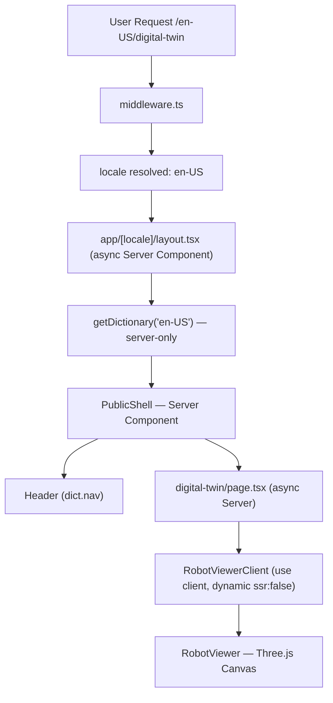
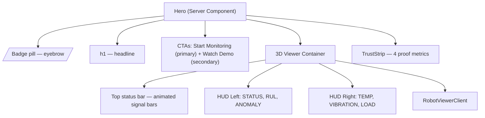
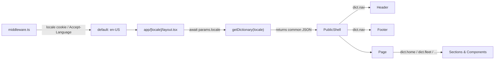
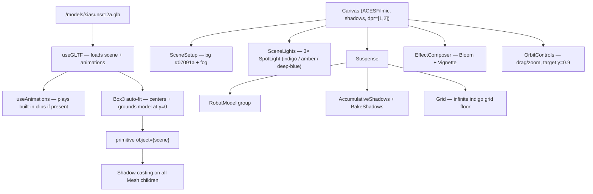
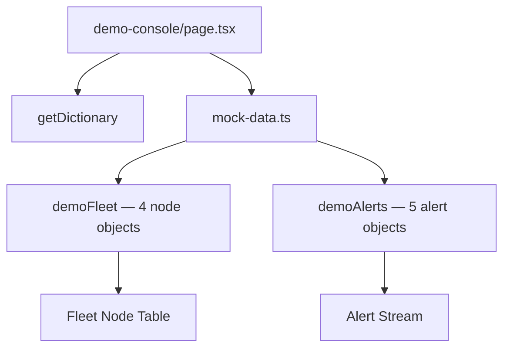

# Arm Health AI — Frontend Architecture

> **Last updated:** April 2026 · Aligned with current implementation

## 1. Purpose

This document defines the frontend architecture for Arm Health AI as it exists today. It covers the routing strategy, component model, i18n system, 3D visualization pipeline, rendering pattern, and design decisions made during the April 2026 implementation sprint.

The frontend serves three primary experiences:

1. **Public marketing site** — Technical credibility, conversion-optimized copy, and an interactive 3D Digital Twin demo.
2. **Demo Console** — No-login sandbox with a realistic simulated robotic fleet (fleet table + alert stream).
3. **Authenticated Operations Console** — Planned for Phase 2; will surface live telemetry, RUL forecasts, joint health, and alert management.

---

## 2. Design Principles (Applied)

| Principle | Decision |
|---|---|
| Conversion over whitespace | Dense trust strip, HUD overlays on robot, proof metrics immediately visible |
| B2B Asia density | Data-forward layout: metrics visible without interaction, compact panels |
| Server-first rendering | All public pages are async Server Components; `'use client'` only where necessary |
| i18n by default | Every string goes through `getDictionary()` — no hardcoded UI copy |
| 3D as product evidence | The robot viewer IS the demo — not a decoration |
| Premium aesthetic | ACES filmic, Bloom, nav glassmorphism, mega-menus, indigo brand palette |

---

## 3. Tech Stack (Actual)

### Core

| Package | Version | Purpose |
|---|---|---|
| `next` | 15.x | App Router, Server Components, middleware |
| `react` | 19.x | UI framework |
| `typescript` | 5.x | Type safety |

### Styling

Vanilla CSS with a custom design system (`src/app/globals.css`). No Tailwind. Utility classes defined as CSS custom properties for spacing, color tokens, and component variants.

> **Why not Tailwind?** The project uses a custom CSS design system that predates the i18n sprint. Adding Tailwind would introduce a conflicting utility layer. Decision: remain on Vanilla CSS unless explicitly migrated.

### 3D Visualization

| Package | Purpose |
|---|---|
| `three` | WebGL math, geometry, materials |
| `@react-three/fiber` | React renderer for Three.js scenes |
| `@react-three/drei` | Helpers: `useGLTF`, `useAnimations`, `OrbitControls`, `SpotLight`, `Grid`, `AccumulativeShadows`, `useDepthBuffer` |
| `@react-three/postprocessing` | Effects: `Bloom`, `Vignette`, `EffectComposer` |

### Internationalization

Custom implementation on top of Next.js App Router — no `next-intl` or `i18next` dependency.

| File | Role |
|---|---|
| `src/middleware.ts` | Intercepts bare routes, redirects to `/en-US` |
| `src/lib/i18n.ts` | `getDictionary(locale)` — server-only async loader |
| `src/locales/en-US/common.json` | Full English dictionary |
| `src/locales/zh-Hans/common.json` | Full Simplified Chinese dictionary |

---

## 4. Folder Structure (Current)

```
src/
├── app/
│   ├── [locale]/                        ← BCP-47 dynamic locale segment
│   │   ├── layout.tsx                   ← Async root layout; awaits params, sets <html lang>
│   │   ├── (public)/
│   │   │   ├── layout.tsx               ← Loads getDictionary, passes to PublicShell
│   │   │   ├── page.tsx                 ← Landing (Hero + Process + FeatureSplit + ContactCta)
│   │   │   ├── platform/page.tsx
│   │   │   ├── digital-twin/page.tsx    ← 3D viewer + joint feature cards
│   │   │   ├── ai-engine/page.tsx       ← LSTM explainer + RUL chart
│   │   │   ├── fleet/page.tsx           ← Fleet metrics + map placeholder
│   │   │   ├── use-cases/page.tsx       ← Industry case cards
│   │   │   ├── demo-console/page.tsx    ← Fleet table + alert stream
│   │   │   └── pricing/page.tsx
│   │   ├── (onboarding)/                ← ← Planned Phase 2
│   │   └── (app)/                       ← ← Planned Phase 2
│   └── globals.css                      ← Design system tokens + component styles
├── components/
│   ├── home/
│   │   ├── Hero.tsx                     ← Eyebrow + headline + CTAs + HUD + trust strip
│   │   ├── ProcessSection.tsx
│   │   ├── FeatureSplit.tsx
│   │   └── ContactCta.tsx
│   ├── layout/
│   │   ├── Header.tsx                   ← Glassmorphism nav + mega-menus + language switcher
│   │   ├── Footer.tsx
│   │   └── public-shell.tsx             ← Injects dict into Header + Footer
│   ├── three/
│   │   ├── RobotViewer.tsx              ← R3F Canvas; SceneSetup, SceneLights, RobotModel, BaseGlow
│   │   └── RobotViewerClient.tsx        ← 'use client' wrapper with next/dynamic ssr:false
│   └── ui/
│       ├── badge.tsx
│       └── card.tsx
├── lib/
│   ├── i18n.ts                          ← getDictionary() — server-only
│   └── mock-data.ts                     ← Simulated fleet nodes + alert entries
├── locales/
│   ├── en-US/common.json
│   └── zh-Hans/common.json
└── middleware.ts                        ← Locale detection + redirect
```

---

## 5. Rendering Strategy



**Rules:**
- All `app/[locale]/**/page.tsx` are **async Server Components** — they call `getDictionary()` directly.
- `'use client'` is used only for: `Header` (scroll state), `RobotViewerClient` (Three.js), `Footer` (if needed).
- `next/dynamic` with `ssr: false` must live inside a `'use client'` component — never in a Server Component.
- The `[locale]/layout.tsx` must `await params` before accessing `params.locale` (Next.js 15 requirement).

---

## 6. Component Patterns

### Server Component (public page)
```tsx
// src/app/[locale]/(public)/fleet/page.tsx
export default async function FleetPage({ params }: { params: Promise<{ locale: string }> }) {
  const { locale } = await params;
  const { common } = await getDictionary(locale);
  const t = common.fleet;
  return <main>{t.title}</main>;
}
```

### Client Component with SSR-disabled 3D
```tsx
// src/components/three/RobotViewerClient.tsx
'use client';
const RobotViewerDynamic = dynamic(
  () => import('./RobotViewer').then(m => m.RobotViewer),
  { ssr: false, loading: () => <Spinner /> }
);
export function RobotViewerClient(props) { return <RobotViewerDynamic {...props} />; }
```

### R3F Hook Rule
R3F hooks (`useDepthBuffer`, `useFrame`, `useThree`, `useGLTF`) can **only** be called inside the R3F component tree (inside `<Canvas>`). They must live in child components, not in the component that renders `<Canvas>`.

```tsx
// ✅ Correct
function SceneLights() {
  const depthBuffer = useDepthBuffer({ frames: 1 }); // inside Canvas tree
  return <SpotLight depthBuffer={depthBuffer} ... />;
}

// ❌ Wrong — useDepthBuffer outside Canvas
function RobotViewer() {
  const depthBuffer = useDepthBuffer({ frames: 1 }); // Runtime error!
  return <Canvas><SceneLights /></Canvas>;
}
```

---

## 7. Hero Component Architecture

The Hero is the most architecturally rich public component — it combines copy, CTAs, 3D viewer, HUD overlays, and trust metrics.



**HUD cards** are CSS-positioned `div` elements layered over the `<Canvas>` with `pointer-events: none`. They use `backdrop-blur + bg-black/60 + border-white/10` for the glassmorphism effect.

---

## 8. Header / Navigation

The Header is a client component (needs scroll state) with:

- **Glassmorphism:** `backdrop-blur + bg-[#0a0f25]/80 + border-b border-white/10`
- **Mega-menus:** CSS hover groups using Tailwind-compatible class composition
- **Language switcher:** Globe icon → opens locale picker (routes to `/{locale}/...`)
- **CTAs:** `Start Free Trial` (primary pill button) + Login icon

**Nav structure (current):**
```
Product ▾          Use Cases ▾       Pricing    Docs ▾
  ├ Overview         ├ Manufacturing
  ├ Digital Twin     ├ Welding Robots
  ├ AI Engine        ├ Assembly Lines
  └ Fleet            └ Capabilities
```

Dictionary keys: `nav.product`, `nav.platform`, `nav.fleet`, `nav.useCases`, `nav.pricing`, `nav.resources`, `nav.signup`

---

## 9. Internationalization Flow



**Dictionary prop flow:** Each page receives `dict` from `getDictionary()` and threads the relevant sub-object (`dict.common.home`, `dict.common.fleet`…) down to its components as props. No global context is used.

---

## 10. 3D Viewer Pipeline



**Camera defaults:**
- `fov: 38` · `near: 0.1` · `far: 100`
- Default position: `[0, 1.8, 3.8]`
- Hero position: `[0, 1.8, 3.8]`  
- Digital Twin position: `[0, 2, 4]`

---

## 11. Performance Decisions

| Decision | Rationale |
|---|---|
| `next/dynamic` for R3F | Three.js is ~900KB; SSR of a WebGL canvas makes no sense |
| Server Components for all pages | Zero hydration cost for marketing content |
| `getDictionary` is `server-only` | Prevents accidental client-side bundle inclusion of locale files |
| `BakeShadows` in 3D scene | Bakes static shadow passes; reduces per-frame GPU cost |
| `dpr={[1, 2]}` on Canvas | Caps at 2× retina; prevents 3× DPR on high-density displays |
| `AccumulativeShadows frames={80}` | High-quality shadows baked over 80 frames at startup |
| Spinner loading state | Shows indigo animated ring; avoids layout shift during dynamic load |

---

## 12. Demo Console

The public demo console (`/demo-console`) renders entirely with simulated data from `src/lib/mock-data.ts`. No backend call is made.



Fleet node shape:
```ts
{ id, region, status, temperature, cpu, memory, rul }
```

Alert shape:
```ts
{ id, title, node, time, level: 'critical' | 'warning' | 'info' }
```

All table headers and badges use `dict.demo.*` keys for full i18n.

---

## 13. Planned — Phase 2 (Authenticated Console)

When Phase 2 begins, the authenticated console will live under `/(app)/*` within the `[locale]` segment and will add:

- Live WebSocket / SSE telemetry streams
- TanStack Query for server state and request deduplication
- Zustand for UI state (selected node, filter state, panel collapse)
- `/app/fleet` — multi-node health overview
- `/app/nodes/[id]` — per-joint telemetry drill-down
- `/app/alerts` — alert queue + work order generation
- `/app/metrics` — time-series charts (ECharts or Recharts)

The 3D Digital Twin `RobotViewer` will be embedded in the Node Detail page as a side panel.

---

## 14. GLB Rigging — Next Steps

> The current SIASUN SR12A GLB is a CAD export. All joint segments are siblings under the root node — not a kinematic chain. Joint-level articulation animation is not possible without rigging.

**To enable full joint animation in Blender:**

1. Open `public/models/siasunsr12a.glb` in Blender
2. Add Armature → create 6 bones: `J1` (base) through `J6` (tool)
3. Parent each mesh segment to its corresponding bone (`Parent → Bone`)
4. Set rest pose and keyframe a pick-and-place animation cycle
5. Export as GLB with: `Include → Armature ✓`, `Animation → NLA Strips ✓`
6. Replace `public/models/siasunsr12a.glb` — `useAnimations` will detect and play the clips automatically

---

## 15. Implementation Checklist

| Item | Status |
|---|---|
| `[locale]` dynamic routing | ✅ |
| Middleware locale redirect | ✅ |
| `getDictionary()` server-only loader | ✅ |
| `en-US` full dictionary | ✅ |
| `zh-Hans` full dictionary | ✅ |
| Header + language switcher | ✅ |
| Hero redesign (strong headline + CTAs + HUD) | ✅ |
| Trust strip (4 proof metrics) | ✅ |
| 3D SIASUN viewer (GLB + lighting + post-processing) | ✅ |
| Digital Twin page | ✅ |
| AI Engine page | ✅ |
| Fleet page | ✅ |
| Use Cases page | ✅ |
| Demo Console (simulated) | ✅ |
| Pricing page | ✅ |
| GLB rigging (Blender) | 🔲 |
| Auth + onboarding flow | 🔲 |
| Authenticated app shell | 🔲 |
| Live telemetry integration | 🔲 |
